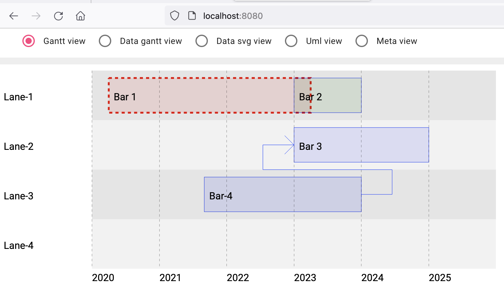

# gantt


## Requirements


- [ ] go (version >= 1.19)
- [ ] node (version >= 18.xx)
- [ ] vscode (>= 1.75)
- [ ] gopls >= 0.37

## count the number of go lines of code

```
git clone https://github.com/fullstack-lang/gantt
cd gantt
find gantt2svg models cmd -name '*.go' -type f -print0 | xargs -0 wc -l

   57 gantt2svg/generate_arrow.go
  379 gantt2svg/generate_svg.go
   11 models/arrow.go
   16 models/bar.go
   88 models/gantt.go
    8 models/group.go
   15 models/lane.go
   15 models/milestone.go
   12 models/note_on_the_model.go
  165 cmd/gantt/gantt1.go
  190 cmd/gantt/main.go
  956 total
```

## generate the application

```
npm install -g @angular/cli@15
go install github.com/fullstack-lang/gong/go/cmd/gongc
gongc go/models
```

## Patch the font app application


### Import the modules for SVG display

in file ng/src/app/app.module.ts

```ts
...
import { GongModule } from 'gong'

// add the two following lines 
import { GongsvgModule } from 'gongsvg'
import { GongsvgspecificModule } from 'gongsvgspecific'
...

    GongModule,

    // add the two following lines 
    GongsvgspecificModule,
    GongsvgModule,

```

### Edit the import path

in ng/tsconfig.json

```json
      "gantt": [
        "projects/gantt/src/public-api.ts"
      ],

      // add the following import path
      "gongsvg": [
        "../vendor/github.com/fullstack-lang/gongsvg/ng/projects/gongsvg/src/public-api.ts"
      ],
      "gongsvgspecific": [
        "../vendor/github.com/fullstack-lang/gongsvg/ng/projects/gongsvgspecific/src/public-api.ts"
      ],
```

### Add a tab to the generated application

replace content of ng/src/app/app.component.ts with

```ts
import { Component } from '@angular/core';

@Component({
  selector: 'app-root',
  templateUrl: './app.component.html',
})
export class AppComponent {

  view = 'Gantt view'
  gantt = 'Gantt view'
  default = 'Data gantt view'
  meta = 'Meta view'
  data_svg = 'Data svg view'
  diagrams = 'Uml view'

  views: string[] = [this.gantt, this.default, this.data_svg, this.diagrams, this.meta];
}
```

in ng/src/app/app.component.html

add the following elemets at the beginning of the file

```html
<as-split *ngIf="view==gantt" direction="vertical">
    <as-split-area [size]=05>
        &nbsp;&nbsp;&nbsp;&nbsp;&nbsp;&nbsp;
        <mat-radio-group aria-label="Select an option" [(ngModel)]="view">
            <mat-radio-button *ngFor="let view of views" [value]="view">
                {{view}}&nbsp;&nbsp;&nbsp;
            </mat-radio-button>
        </mat-radio-group>
    </as-split-area>
    <as-split-area [size]=95>
        <lib-svg></lib-svg>
    </as-split-area>
</as-split>

<as-split *ngIf="view==data_svg" direction="vertical">
    <as-split-area [size]=05>
        &nbsp;&nbsp;&nbsp;&nbsp;&nbsp;&nbsp;
        <mat-radio-group aria-label="Select an option" [(ngModel)]="view">
            <mat-radio-button *ngFor="let view of views" [value]="view">
                {{view}}&nbsp;&nbsp;&nbsp;
            </mat-radio-button>
        </mat-radio-group>
    </as-split-area>
    <as-split-area [size]=95>
        <app-gongsvg-splitter></app-gongsvg-splitter>
    </as-split-area>
</as-split>
```

## re compile and run the application


```
gongc go/models
cd go/cmd/gantt
./gantt -unmarshallFromCode=gantt1.go -marshallOnCommit=gantt1 
```


## navigating to the application

with a navigator (for unknown reasons, it does not work with firefox on mac), navigate to http://localhost:8080/.

then navigate to the display of the UML diagram by clicking on the `Diagrams view` then select `New Diagram`.

You should see




