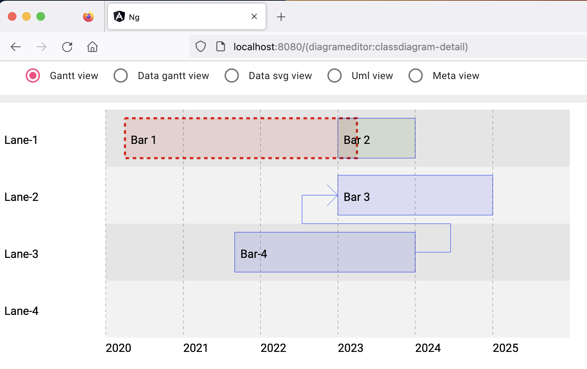
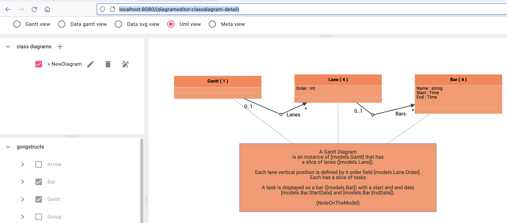
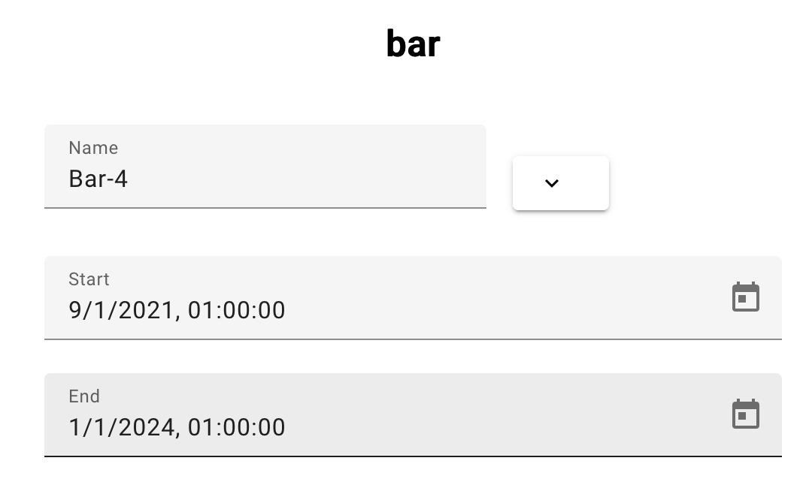

A fullstack gantt chart editor in less than 1k lines of go.

 <!-- title: Fullstack Gantt v01 -->

# Description

## The problem to solve

I am employed at a company that is a subsidiary of Airbus, a manufacturer in the aerospace industry. Our role is to perform system engineering for air traffic management systems, and we assist our clients in coordinating the deployment of interconnected systems. Sometimes, to solve complex problems, we need to create customized applications, and the models for these applications can consist of over a hundred tables. We prefer using the programming language Go for our applications because it can handle the complexity of our models well.

On occasion, we need to incorporate a gantt chart display into our application. However, the gantt chart is usually not standard, and we may want to add bespoke elements to their scheduling modeling. The available components on the market are rarely suitable for their specific needs and can be too complicated.

To address this issue, we need to develop a full-stack application that meets the following requirements:

- a back end in go
- a front end in angular
- a data model that can evolve rapidly
- minimal development effort

Our system engineers must focus on the problem model rather than the complexities of full-stack development. They do not wish to learn the front-end language or techniques required for each layer of the full-stack.

## Proposed solution

Our approach involves using code generation from models written in the programming language Go. This requires the system engineer to complete four steps to create their personalized gantt chart application: 

- writing their own unique gantt chart models in Go,
- creating the display for their concepts in Scalable Vector Graphics (SVG) using Go, 
- generating the code from the models, 
- and converting their data models into objects in the gantt chart model.

This solution fulfills the necessary requirements. The standalone gantt chart application is available for review on the GitHub repository, which includes instructions for building the fullstack application. The application consists of a few Go files with less than 1000 lines of code.

The present talk is divided into three parts: an overview of the fullstack elements, a demonstration of how to generate code by parsing the Go model, and an explanation of how the gantt data model can evolve quickly by generating and parsing code at runtime.

# The gant chart fullstack application

## Starting web application

The application showcase is a basic gantt chart web editor. Once it has been generated/compiled, the application is pretty compact at 71 MB.

```
% cd go/cmd/gantt
% ls -lh gantt| awk '{print $5, $9}' 

71M gantt
```

The application can be started from the command line

```
% ./gantt -unmarshallFromCode=gantt1.go -marshallOnCommit=gantt1 
```

The runtime memory footprint is less than 50 MB on average on a mac book.

```
% ps aux | grep gantt | grep -v grep | awk '{printf "%-30s %5dMB\n", $11, $6/1024}'
./gantt                       38MB
```

## Navigating the web application

To start off, I would like to share a visual representation of a Gantt chart. This chart can help you understand the different elements that make it up: the chart, the lanes and the bars with their start and end date.



- I will present the UML model of the Gantt application (this is included in the web application).



- I modify the start date of "Bar-4" by selecting it in angular table component.


- I edit the date to start to 2020 in a angular form component suite for the bar object.



- I see the result in the gantt diagram.


# Architecture of the fullstack application

This part of the presentation will cover the structure of a fullstack application. We'll go through the entire process of changing the start date on the front end using Angular, managing the task on the back end, transforming the task into an SVG rectangle on the back end, and displaying the rectangle on the front end. By following the control flow, we'll be able to explore the different components of the application's architecture.

To outline the anatomy of a full stack application, we'll cover several key parts, including:

- Angular Material, which provides the form used for editing the date
- Angular services, which are used to call the API for updating the date
- Controllers, which implement the REST API using the Gin framework
- ORM, which is implemented using GORM
- The database, which uses the SQLite pure Go driver.


Things are getting a bit more complex now because there aren't just one, but two full stacks involved (there is a third one for the UML diagramming but it not covered in the presentation).

The first stack allows for editing and saving of the Gantt diagram elements.

The second stack is responsible for displaying the SVG using standard Angular components. This second stack has a model in Go that describes the typical SVG objects. The stack is reused whenever there is a need to display SVG content. You can check the code the SVG stack at https://github.com/fullstack-lang/gongsvg.

Every time the scheduling is changed, the application translates the gantt model into a svg model and this is done in a "gantt2svg" pacakge.


- The Go code converts each object of the gantt model into an SVG object.
- The front-end of the Gantt chart display, which is an Angular SVG component, detects any changes in the back-end data and refreshes the front-end accordingly.

# Generating code from the parsing of the data models

In this part, I will explain how to generate code with git and the use of the go abstract syntax tree of the data models.

But first, let see what part of the code is generated. Pretty everything indeed since only the model code and the conversion code are manualy written.


After removing the generated code, one sees that the whole code is less than 1k lines.

```
$ find gantt2svg models cmd -name '*.go' -type f -print0 | xargs -0 wc -l
   57 gantt2svg/generate_arrow.go
  379 gantt2svg/generate_svg.go
   11 models/arrow.go
   16 models/bar.go
   88 models/gantt.go
    8 models/group.go
   15 models/lane.go
   15 models/milestone.go
   12 models/note_on_the_model.go
  165 cmd/gantt/gantt1.go
  190 cmd/gantt/main.go
  956 total
```

Go makes it very easy to parse the AST (abstract syntax tree) of models. So the idea is that every time you write a repetitive piece of code that follows a consistent pattern across different model objects, you can write a code generator that creates the same code by analyzing the model. This saves you from having to write the same code over and over again, and allows you to generate complex code with just a few lines of generator code.


Developing code generation has the advantage of being able to use generators from one project to another, provided that the go code defining models follows certain stereotypes. For example:

- any go `struct` with a `Name string` field can be translated into a database table, 
- associations can be represented as pointers or slices of pointers,
- `const` of type `string` or `int` are considered enums for the front end code. 

These generators are currently in an open source project at https://github.com/fullstack-lang/gong.

# Go code that generates go code that generates go code

That brings my talk to a close. Before I wrap up, I'd like to inject some more fun. Even though it may seem strange to generate Go code at this stage, I want to illustrate why generating Go code on-the-fly from the generated code can be fascinating. I'll show you why we might want to do this.

## Data persisted as go code

It seems counter intuitive to store data as go code but there is a use case where the `go` format is more economical than alternatives (i.e. database or `json` file).

We develop a use case that is close to the need of having the gantt diagram model evolve rapidly. In this use case, we have three important items, taken from our example:

- A data model for a gantt diagram. This model is the same as the preceeding model but the struct `Bar` is called `Foo`.
- The scheduling data for the gantt example (saved in a json file).
- The UML diagram that shows the `Foo` struct (saved in the UML tool database).

Here is the UML diagram:


It is clear that the name `Bar` is a better fit for the tasks in a gantt chart than `Foo`. 
In response, we need to make three changes to our code:

1. We need to use gopls to rename Foo to Bar in our go code.
2. We need to rename Foo to Bar in our json file.
3. We need to rename Foo to Bar in our UML diagram.

This process can take anywhere from 5 to 15 minutes, but the second and third steps can take up the majority of that time. Unfortunately, this can be a distraction from the actual coding process. We would like to find ways to reduce the time it takes to make these changes so that we can focus more on coding.

Let's explore an alternative method of saving data by storing it as Go code instead of using JSON. This requires us to generate the code from the data. This generator is itself created from the parsing the Go models. Additionally, we must generate an AST parser, which is also generated from the parsing of the Go model, so that we can read the generated Go code that encodes the data. In summary, we have go code that generates go code that generates go code and parses go code.

Why is it interesting ? Let's see our data file in go that contains declarations lines like:

```go
	__Foo__000000_Foo_4 := (&models.Foo{Name: `Bar-4`})
```

This new persistence approach makes the refactoring simpler because, in the first renaming step from `Foo` to `Bar`, `gopls` will also edit this go file into:

```go
	__Foo__000000_Foo_4 := (&models.Bar{Name: `Bar-4`})
```

We save the json refactoring step. We save (boring) minutes.

## UML diagram persisted as go code

Using go code to skip the json renaming step is cost-effective, but now we want to skip the UML refactoring step as well. Our goal is to have `gopls` refactor the UML diagram data. To allow for renaming, we will follow the same process we used for the gantt diagram data: encoding the UML diagram in go code.

When describing the UML diagram in Go code, it's important to specify that the shape representing the Foo struct actually refers to the `models.Foo` struct in the code. However, if we simply encode this reference as a string like "models.Foo" as shown below, we run into a problem:

```go
   shape.ref = "models.Foo"
```

We have a problem because when we use a string to represent `models.Foo`, the automatic renaming process won't work. So, if we wanted to rename `models.Foo` to `models.Bar`, gopls wouldn't be able to do it because `"models.Foo"` is just a string and can't be renamed in the same way as the actual code (gopls works with identifiers only).

## Enters go 1.19 and DocLink

With the DocLink syntax such as `[Name1]`, `[Name1.Name2]` or `[pkg.Name1]`, go 1.19 implicitly introduces a new kind of type, a type for identifiers. The good piece of news is that this type can be assigned to a string variable and this can solve our problem.

Technically, this can be done with a comment directive followed by a DocLink item. The go 1.19 `go/ast/comment.Parser` package provides the concept and the dedicated parsing functions for getting DocLink in comments. The following assignment of the `models.Foo` identifier to a string can be done by parsing something like

```go
  //gong:ident [models.Foo]
  shape.ref = "models.Foo"
```

We can ask the generated AST parser to assign the DocLink text to the string value whenever it meets this kind of comment followed by a string assignment (note that `//gong:ident` works like a `//go:embed`).

`gopls` will perform the renaming request of `models.Foo` to `models.Bar` and it will change the code to

```go
  //gong:ident [models.Bar]
  shape.ref = "models.Foo"
```

And the generated AST parser will assign the correct new value to the shape.

Conclusion, the refactoring of the three artifacts takes less that a minute, a nice productivity gain ! This was done thanks to a generated parser that is able to read generated code from generated code.

well, so far, so good, but ... there is still a problem, `gopls` does not yet refactor docLink (see issue https://github.com/golang/go/issues/57559), but the workaround is left for another story.

# Conclusion

The purpose of this presentation was to demonstrate the advantages of using Go for developing small web applications that need to evolve very rapidly.

The work showcased is a part of a bigger research and development initiative that aims to investigate whether Go can be utilized for defining models, known as "Domain Specific Languages," for various aspects of system engineering.